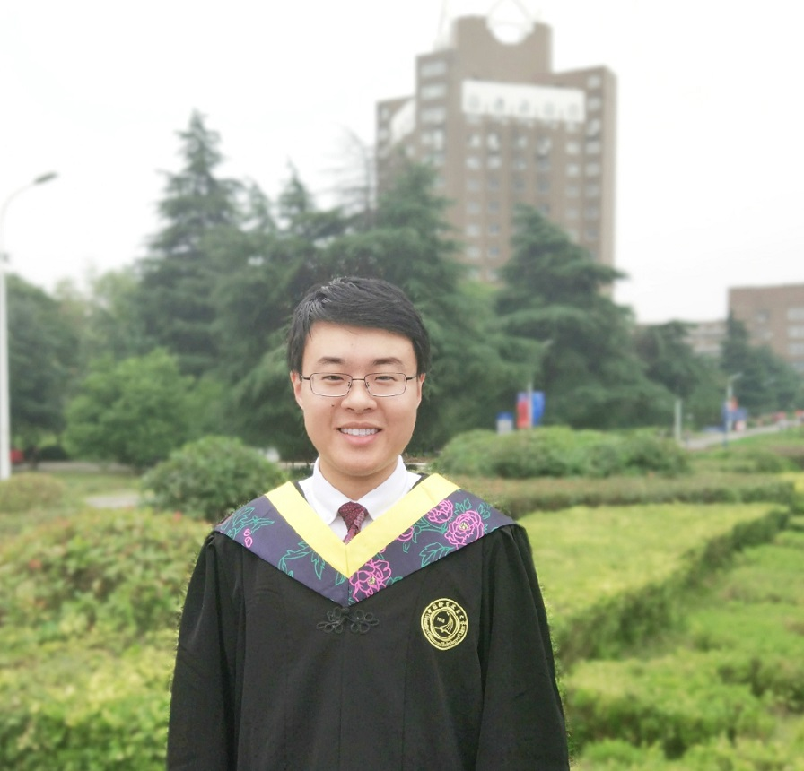

---
layout: default
section: chinese
title: "Hang Wang: Homepage"
---

# Hang (Mike) Wang


&nbsp;

欢迎来到我的个人主页! 

王航(拼音：Wang Hang), 本科毕业于中国科学技术大学信息科学技术学院自动化系（[University of Science and Technology of China, P. R. China](http://www.ustc.edu.cn/)）. 我是信息科技英才班的成员. 同时我也是中国科学技术大学健康信息学实验室成员（ [Health Informatics Lab](http://bioinformatics.ustc.edu.cn/) ），我的导师是 [李骜教授](http://bioinformatics.ustc.edu.cn/teams.html).

我的研究兴趣是数据挖掘以及其在医疗、社交媒体、金融分析等领域的应用.我同样对机器学习和人工智能有强烈的兴趣.

&nbsp;

## 教育经历
  *  工学学士学位，自动化专业(加权平均分87/100，院系排名7/93), 信息科技英才班, 中国科学技术大学, 2014~2018([中国科大六十周年校庆，2018](http://xq.ustc.edu.cn))

## 新消息
  * 20日-9月-2018: __红专并进一甲子，科教报国六十年，祝贺母校中国科大六十华诞！__
  * 9月-2018： 我将前往新加坡南洋理工大学（NTU），在[Prof. Wen Yonggang](http://www.ntu.edu.sg/home/ygwen/)的指导下完成科研工作，感谢您！
  * 8月-2018:  我的论文Dual-layer Strengthened Collaborative Topic Regression Modeling for Predicting Drug Sensitivity被IEEE/ACM TCBB接收！感谢我的合作者李骜教授，王明会教授，习佳宁博士！
  * 7月-2018:  我将前往[商汤科技](https://www.sensetime.com), 以及[孙鹏博士](https://www.linkedin.com/in/sunpengsdu/)的指导下展开为期3个月的暑期实习!
  * 7月-2018:  我将从 [USTC](http://www.ustc.edu.cn/) 本科毕业，同时我从英才班荣誉毕业并获评中国科大2018届优秀毕业生.
  * 5月-2018:  我获得了中科大优秀毕业论文奖 (评选比例 5%)!
  * 7月-2017:  我将在国家留学基金委的支持下前往荷兰 [University of Twente](https://www.utwente.nl/en/) 在 [Dr.ir. B. J. F. van Beijnum](https://www.utwente.nl/en/eemcs/bss/people/staff/bert_jan_vanbeijnum/%20)的指导下展开为期三个月的暑期研究，感谢CSC的赞助!

&nbsp;
<object classid="clsid:D27CDB6E-AE6D-11cf-96B8-444553540000" 
codebase="http://download.macromedia.com/pub/shockwave/cabs/flash/swflash.cab#version=9,0,16,0" width="180px">
<param name="movie" value="static/info/motion1.swf"> 
<param name="quality" value="high"> 
<param name="play" value="true"> 
<param name="LOOP" value="true"> 
<embed src="static/info/motion3.swf" width="180px" style="float:right; margin-left:30px; margin-top:35px; margin-bottom:10px;" play="true" loop="true" quality="high" pluginspage="http://www.macromedia.com/go/getflashplayer" type="application/x-shockwave-flash"> 
</object> 
## 出版物 (中国科大，本科期间)
  * **[Dual-layer Strengthened Collaborative Topic Regression Modeling for Predicting Drug Sensitivity](static/papers/17-dsctr.pdf)**. *__Hang Wang__, Jianing Xi, Minghui Wang, Ao Li.* Accepted, IEEE/ACM Transactions on Computational Biology and Bioinformatics(TCBB), 10.1109/TCBB.2018.2864739.	
  * **[Graphic Model Based Drug Sensitivity Prediction Research(in Chinese)](static/papers/18-thesis.pdf)**. *__Hang Wang.__* USTC Bachelor Tehsis. **(Excellent Graduation Thesis Award, TOP 5%)**
   * **[One Inertial Sensor Based Metric for Upper-extremity Measurement (Dutch Project)](static/papers/17-tnsre.pdf)**,*__Hang Wang__, Mohamed Irfan Mohamed Refai, Bert-Jan van Beijnum*, Submitted to 12th International Joint Conference on Biomedical Engineering Systems and Technologies,  Prague, Czech, 2019.

## 研究经历
  * **研究工程师, 新加坡南洋理工大学**, 9月 2018 - 9月 2019
	* 项目: 基于区块链的微电网P2P交易系统
	* 指导老师: [Prof. Wen Yonggang](http://www.ntu.edu.sg/home/ygwen/) 和 Dr.Gao Guanyu
	
  * **研究实习, 荷兰特温特大学**, 7月 2017 - 10月 2017
	* 项目: 远程治疗系统的数据融合
	* 指导老师:  Dr. ir. B. J. F. van Beijnnum 和 [Mohamed Irfan Mohamed Refai](https://www.linkedin.com/in/mrmirfan/)

  * **研究助理, 健康信息学实验室, 中科大**, 6月 2016 - 11月 2017
    * 项目: 药物敏感性预测系统
    * 指导老师:  李骜教授 和 王明会教授

## 教学经历
  * **助理教师, 中科大**, 秋季学期 2017
    * 01015901, 自动控制原理, [吴刚教授](http://iia.ustc.edu.cn/iia/?p=33).

## 荣誉奖项
 * 中国科学技术大学信息科技英才班荣誉证书, 2017
 * 中国科学技术大学奖学金银奖 排名前 10%, 2017
 * 中国科学技术大学陈桂林领导力奖学金 排名前 5%, 2016
 * 上海微系统所奖学金 排名前 5%, 2015
 * 新生奖学金铜奖 2014

## 课外活动
 * 中国科学技术大学学生会办公室主任, 2016–2017
 * 中科大校友返校优秀志愿者, 2016
 * 2013版飞跃手册编辑, 2015
 * 中国科学技术大学信息学院三班生活委员, 2014–2018
 * 中国业余小提琴手，8级

