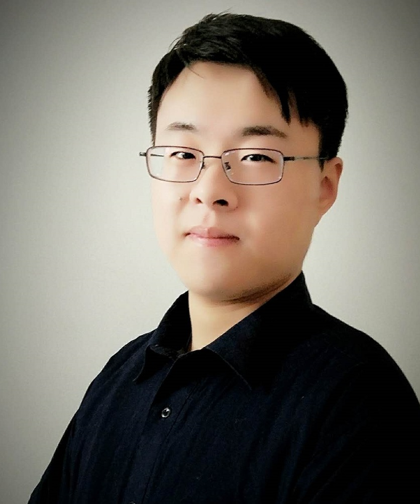

---
layout: default
section: chinese
title: "Hang Wang: Homepage"
---

# Hang (Mike) Wang


&nbsp;

欢迎来到我的个人主页! 

我的名字叫王航, 本科毕业于中国科学技术大学信息科学技术学院自动化系（[University of Science and Technology of China, P. R. China](http://www.ustc.edu.cn/)）. 我是信息科技英才班的成员. 同时我也是中国科学技术大学健康信息学实验室成员（ [Health Informatics Lab](http://bioinformatics.ustc.edu.cn/) ），我的导师是 [李骜教授](http://bioinformatics.ustc.edu.cn/teams.html).

我的研究兴趣是数据挖掘以及其在医疗、社交媒体、金融分析等领域的应用.我同样对机器学习和人工智能有强烈的兴趣.

&nbsp;

## 新消息
  * 7月-2018:  我将前往俄亥俄州立大学参加实习，我的指导老师是 [孙欢教授](http://web.cse.ohio-state.edu/~sun.397/)，谢谢您!
  *  7月-2018:  我将从 [USTC](http://www.ustc.edu.cn/) 本科毕业，同时我获得了中国科大优秀毕业生、英才班荣誉证书等荣誉.
  * 5月-2018:  我获得了中科大优秀毕业论文奖 (排名前 5%)!
  * 7月-2017:  我将前往荷兰 [University of Twente](https://www.utwente.nl/en/) 在 [Dr.ir. B. J. F. van Beijnum](https://www.utwente.nl/en/eemcs/bss/people/staff/bert_jan_vanbeijnum/%20)的指导下展开为期三个月的暑期研究，感谢CSC的赞助!

&nbsp;

## 出版物
  * **[Dual-layer Strengthened Collaborative Topic Regression Modeling for Predicting Drug Sensitivity](static/papers/17-dsctr.pdf)**. *__Hang Wang__, Jianing Xi, Minghui Wang, Ao Li.* Under Review, IEEE/ACM Transactions on Computational Biology and Bioinformatics(TCBB), November 2017.	
  * **[One Inertial Sensor Based Upper Extremity Usage Measurement and Standard](static/papers/17-tnsre.pdf)**.  *__Hang Wang__, Mohamed Irfan Mohamed Refai, B. J. F. van Beijnnum.* Under Review, IEEE Transaction on Neural Systems and Rehabilitation Engineering(TNSRE), June 2018. 
  * **[Graphic Model Based Drug Sensitivity Prediction Research(in Chinese)](static/papers/18-thesis.pdf)**. *__Hang Wang.__* USTC Bachelor Tehsis. **(Excellent Graduation Thesis Award, TOP 5%)**

## 研究经历
  * **研究实习, 荷兰特温特大学**, 7月 2017 - 10月 2017
	* 项目: 远程治疗系统的数据融合
	* 指导老师:  Dr. ir. B. J. F. van Beijnnum 和 [Mohamed Irfan Mohamed Refai](https://www.linkedin.com/in/mrmirfan/)

  * **研究助理, 健康信息学实验室, 中科大**, 6月 2016 - 11月 2017
    * 项目: 药物敏感性预测系统
    * 指导老师:  李骜教授 和 王明会教授

## 教学经历
  * **助理教师, 中科大**, 秋季学期 2017
    * 01015901, 自动控制原理, [吴刚教授](http://iia.ustc.edu.cn/iia/?p=33).

## 荣誉奖项
 * 中国科学技术大学信息科技英才班荣誉证书, 2017
 * 中国科学技术大学奖学金银奖 排名前 10%, 2017
 * 中国科学技术大学陈桂林领导力奖学金 排名前 5%, 2016
 * 上海微系统所奖学金 排名前 5%, 2015
 * 新生奖学金铜奖 2014

## 课外活动
 * 中国科学技术大学学生会办公室主任, 2016–2017
 * 中科大校友返校优秀志愿者, 2016
 * 2013版飞跃手册编辑, 2015
 * 中国科学技术大学信息学院三班生活委员, 2014–2018
 * 中国业余小提琴手