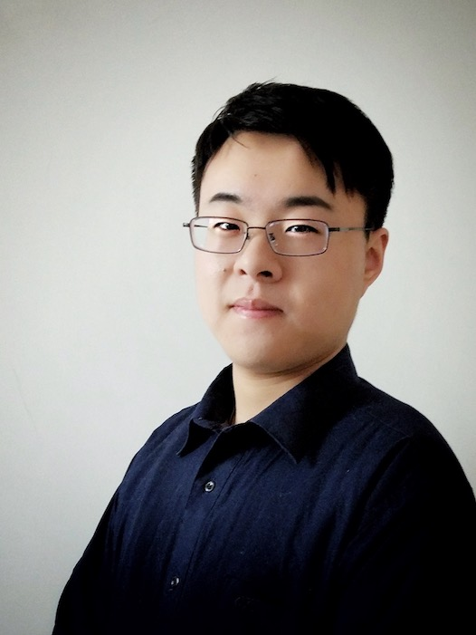

# Hang (Mike) WONG

&nbsp;

Welcome to my homepage! 

__Hang WANG is now looking for PhD position on this planet (the Earth)!__

My name is Hang(航) WONG(or WANG, 王), I received my B.E. from Automation, School of Information Science and Technology, [University of Science and Technology of China, P. R. China](http://www.ustc.edu.cn/)(USTC). I was the member of The Talent Program in Information Science and Technology, USTC. I was also the member of the [Health Informatics Lab](http://bioinformatics.ustc.edu.cn/) and my advisor is [Prof. Ao Li](http://bioinformatics.ustc.edu.cn/teams.html).

My research interests include data mining and its wide application on biomedical information, social media, financial analysis and related fields. Also I'm thrilled about Machine Learning and Artificial Intelligence.

&nbsp;

## Education
  *  B.E., Automation（Rank 7/93），Talent Program in School of Information Science and Technology, University of Science and Technology of China, 2014~2018([USTC 60TH ANNIVERSARY](http://xq.ustc.edu.cn))

&nbsp;
## What's New
  *  20-Sep-2018: __Happy 60TH ANNIVERSARY to my alma mater, USTC!__
  *  Sep-2018: I'm leaving for Nanyang Technological University(NTU) as Research Engineer in SCSE, under the supervision of [Prof. Wen Yonggang](http://www.ntu.edu.sg/home/ygwen/). Thank you for the opportunity, Prof. Wen.
  *  Aug-2018:   My paper "Dual-layer Strengthened Collaborative Topic Regression Modeling for Predicting Drug Sensitivity" is accepted by IEEE/ACM TCBB! Thanks to Prof.Li Ao, Prof.Wang Minghui and Dr. Xi Jianing!
  *  July-2018:  I'm going to [Sensetime](https://www.sensetime.com) in Shenzhen for a three-month internship, under the supervision of [Dr. Sun Peng](https://www.linkedin.com/in/sunpengsdu/)!
  *  July-2018:  I'm going to graduate from [USTC](http://www.ustc.edu.cn/) with the Outstanding Graduate Honor and Talented Program Graduate Honor.
  * May-2018:  I won the Excellent Graduation Thesis Award **(TOP 5% in USTC)**!
  * July-2017:  I'm going to Netherlands for Summer Internship in [University of Twente](https://www.utwente.nl/en/) under the supervision of [Dr.ir. B. J. F. van Beijnum](https://www.utwente.nl/en/eemcs/bss/people/staff/bert_jan_vanbeijnum/%20)!

&nbsp;
<object classid="clsid:D27CDB6E-AE6D-11cf-96B8-444553540000" 
codebase="http://download.macromedia.com/pub/shockwave/cabs/flash/swflash.cab#version=9,0,16,0" width="180px">
<param name="movie" value="static/info/motion1.swf"> 
<param name="quality" value="high"> 
<param name="play" value="true"> 
<param name="LOOP" value="true"> 
<embed src="static/info/motion1.swf" width="180px" style="float:right; margin-left:30px; margin-top:35px; margin-bottom:10px;" play="true" loop="true" quality="high" pluginspage="http://www.macromedia.com/go/getflashplayer" type="application/x-shockwave-flash"> 
</object> 
## Publications (Undergraduate, USTC)
  * **[Dual-layer Strengthened Collaborative Topic Regression Modeling for Predicting Drug Sensitivity](static/papers/17-dsctr.pdf)**. *__Hang Wang__, Jianing Xi, Minghui Wang, Ao Li.* Accepted, IEEE/ACM Transactions on Computational Biology and Bioinformatics(TCBB), 10.1109/TCBB.2018.2864739.	
  * **[Graphic Model Based Drug Sensitivity Prediction Research(in Chinese)](static/papers/18-thesis.pdf)**. *__Hang Wang.__* USTC Bachelor Tehsis. **(Excellent Graduation Thesis Award, TOP 5%)**
  * **[One Inertial Sensor Based Metric for Upper-extremity Measurement (Dutch Project)](static/papers/17-tnsre.pdf)**,*__Hang Wang__, Mohamed Irfan Mohamed Refai, Bert-Jan van Beijnum*, Submitted to 12th International Joint Conference on Biomedical Engineering Systems and Technologies,  Prague, Czech, 2019.

## Research Experience
 * **Research Engineer, Nanyang Technological University, Singapore**, Sep 2018 - Sep 2019
	* Project: Block-chain based microGrid P2P trading
	* Mentor:  [Prof. Wen Yonggang](http://www.ntu.edu.sg/home/ygwen/) and Dr. Gao Guanyu
	
  * **Research Intern, Twente University, Netherland**, July 2017 - Oct 2017
	* Project: DATA FUSION FOR ARM REHABILITATION SYSTEM
	* Mentor:  Prof. ir. B. J. F. van Beijnnum and [Mohamed Irfan Mohamed Refai](https://www.linkedin.com/in/mrmirfan/)

  * **Research Associate, HI Lab, USTC**, June 2016 - Nov 2017
    * Project: Recommender System for drug sensitivity prediction
    * Mentor:  Prof. Ao Li and Prof. Minghui Wang

## Teaching Experience
  * **Teaching Assistant, USTC**, Fall 2017
    * 01015901, Principle of Automation, [Prof. Gang Wu](http://iia.ustc.edu.cn/iia/?p=33).

## Awards and Honors
 * Hornable Degree in School of Information Science and Technology Talented program, Top 5%, 2017
 * The Silver Prize Scholarship Top 10%, 2017
 * University-level excellent League leader Top 5%, 2016
 * Shanghai Institute of Microsystem and Information Technology Scholarship Top 5%, 2015
 * Chen Guilin leadership scholarship Outstanding leadership, 2015
 * Scholarship for Outstanding Fresher 2014

## Extracurriculum Events
 * Director, Comprehensive Affair Office of the USTC Student Union, 2016–2017
 * Volunteer, USTC Alumni Forum Outstanding, 2016
 * Editor, Go Abroad from USTC Handbook, 2015
 * General affairs in class 3 Commissary, 2014–present
 * Chinese amateur violin certificate, level 8 Amateur
